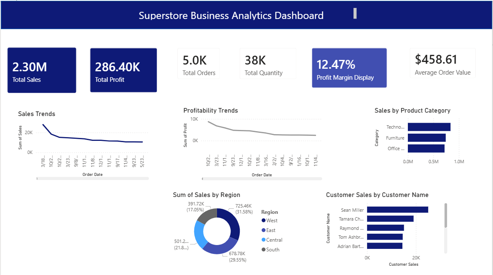

# Superstore Business Analytics Dashboard

## Project Overview
This Power BI dashboard analyzes Superstore sales performance, profit trends, customer segments, and regional insights.

## Live Preview

## Tools Used
- Power BI
- Excel
- DAX
- Data Cleaning
- Data Visualization

## Key KPIs
- Total Sales
- Total Profit
- Profit Margin
- Top Customers
- Top Products
- Regional Performance

## Dashboard Features
- Interactive Filters
- KPI Cards
- Sales Trend Analysis
- Category-wise Profit Analysis
- Top 10 Customers
- Regional Sales Map

## Skills Demonstrated
- Data Cleaning
- DAX Measures
- Power Query
- Dashboard Design
- Business Intelligence
- Data Visualization
- KPI Reporting

## Business Insights
- Technology category contributed highest revenue.
- Furniture category had low profit margins.
- High discounts reduced profitability.
- Western region achieved highest sales.
- Corporate customers generated strong repeat purchases.

## Dataset
Sample Superstore Dataset https://www.kaggle.com/datasets/yesshivam007/superstore-dataset

